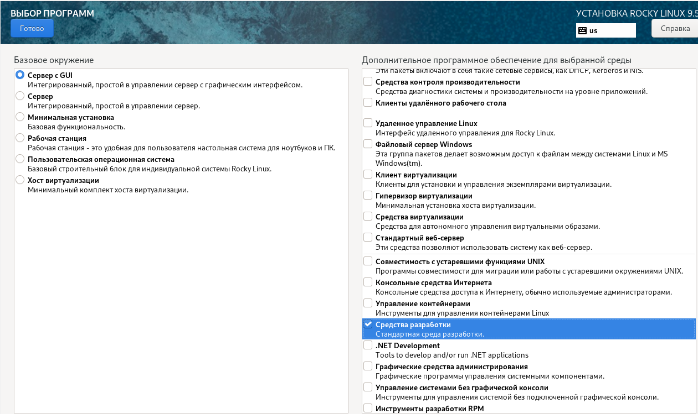
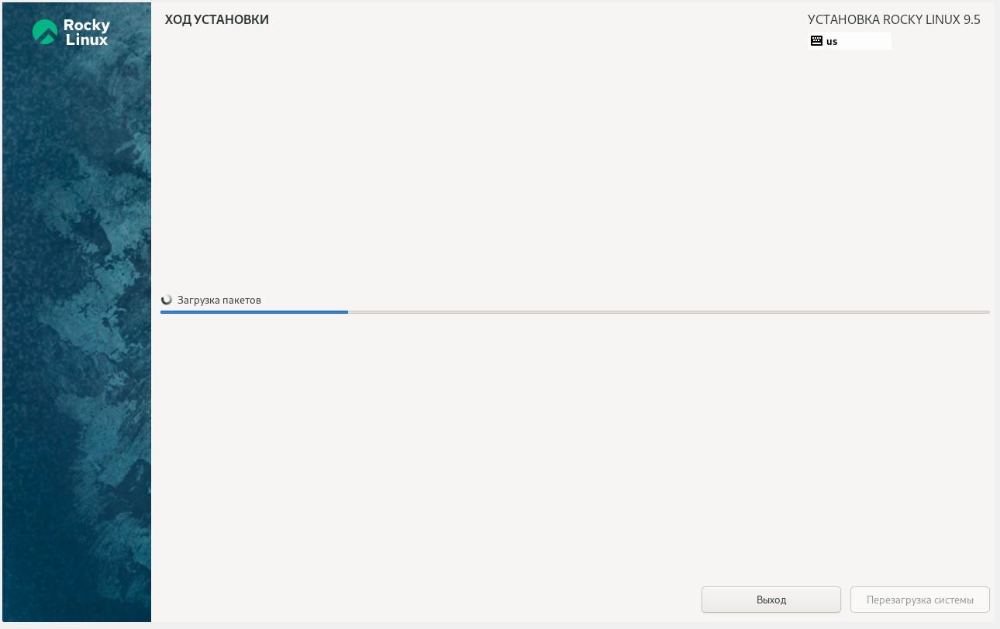

---
## Front matter
lang: ru-RU
title: Отчёт по лабораторной работе №1
subtitle: Основы информационной безопасности
author:
  - Бызова М.О.
institute:
  - Российский университет дружбы народов, Москва, Россия
date: 13 февраля 2025

## i18n babel
babel-lang: russian
babel-otherlangs: english

## Formatting pdf
toc: false
toc-title: Содержание
slide_level: 2
aspectratio: 169
section-titles: true
theme: metropolis
header-includes:
 - \metroset{progressbar=frametitle,sectionpage=progressbar,numbering=fraction}

## Fonts 
mainfont: PT Serif 
romanfont: PT Serif 
sansfont: PT Sans 
monofont: PT Mono 
mainfontoptions: Ligatures=TeX 
romanfontoptions: Ligatures=TeX 
sansfontoptions: Ligatures=TeX,Scale=MatchLowercase 
monofontoptions: Scale=MatchLowercase,Scale=0.9
---

## Цель работы

Целью данной работы является приобретение практических навыков
установки операционной системы на виртуальную машину, настройки ми-
нимально необходимых для дальнейшей работы сервисов.

## Задание

1. Установка и настройка операционной системы.
2. Найти следующую информацию:
	1. Версия ядра Linux (Linux version).
	2. Частота процессора (Detected Mhz processor).
	3. Модель процессора (CPU0).
	4. Объем доступной оперативной памяти (Memory available).
	5. Тип обнаруженного гипервизора (Hypervisor detected).
	6. Тип файловой системы корневого раздела.

## Выполнение лабораторной работы

Я выполняю лабораторную работу на домашнем оборудовании, поэтому создаю новую виртуальную машину в VirtualBox, выбираю имя, местоположение  и образ ISO, устанавливать будем операционную систему Rocku DVD (рис. 1).

{#fig:001 width=40%}

## Выполнение лабораторной работы

Предварительно выбираю имя пользователя и имя хоста (рис. 2).

{#fig:002 width=70%}

## Выполнение лабораторной работы

Выставляю основной памяти размер 2048 Мб, выбираю 2 процессора, чтобы ничего не висло (рис. 3).

{#fig:003 width=70%}

## Выполнение лабораторной работы

Выделаю 40 Гб памяти на виртуальном жестком диске (рис. 4).

{#fig:004 width=70%}

## Выполнение лабораторной работы

Соглашаюсь с проставленными настройками (рис. 5).

{#fig:005 width=40%}

## Выполнение лабораторной работы

Начинается загрузка операционной системы (рис. 6).

{#fig:006 width=40%}

## Выполнение лабораторной работы

При этом должен быть подключен в носителях образ диска! (рис. 7).

{#fig:007 width=40%}

## Выполнение лабораторной работы

Выбираю язык установки (рис. 8).

{#fig:008 width=40%}

## Выполнение лабораторной работы

В обзоре установки будем проверять все настройки и менять на нужные (рис. 9).

{#fig:09 width=40%}

## Выполнение лабораторной работы

Язык раскладки должен быть русский и английский (рис. 10).

{#fig:010 width=70%}

## Выполнение лабораторной работы

Часовой пояс поменяла на московское время (рис. 11).

{#fig:011 width=40%}

## Выполнение лабораторной работы

Установила пароль для администратора (рис. 12).

{#fig:012 width=40%}

## Выполнение лабораторной работы

Для пользователя так же сделала пароль и сделала этого пользователя администратором (рис. 13).

{#fig:013 width=40%}

## Выполнение лабораторной работы

В соответствии с требованием лабораторной работы выбираю окружение сервер с GUB и средства разработки в дополнительном программном обеспечении (рис. 14).

{#fig:014 width=40%}

## Выполнение лабораторной работы

Отключаю kdump (рис. 15).

{#fig:015 width=70%}

## Выполнение лабораторной работы

Проверяю сеть, указываю имя узла в соответствии с соглашением об именовании (рис. 16).

{#fig:016 width=40%}

## Выполнение лабораторной работы

Начало установки (рис. 17).

{#fig:017 width=40%}

## Выполнение лабораторной работы

После заврешения установки образ диска сам пропадет из носителей (рис. 18).

{#fig:018 width=40%}

## Выполнение лабораторной работы

После установки при запуске операционной системы появляется окно выбора пользователя (рис. 19).

{#fig:019 width=40%}

## Выполнение дополнительного задания

Открываю терминал, в нем прописываю dmesg | less (рис. 20).

{#fig:020 width=40%}

## Выполнение дополнительного задания

Версия ядра 5.14.0-362.8.1.el9_3.x86_64 (рис. 21).

{#fig:021 width=70%}

## Выполнение дополнительного задания

Частота процессора 1993 МГц (рис. 22).

{#fig:022 width=70%}

## Выполнение дополнительного задания

Модель процессора Intel Core i7-8550U (рис. 23).

{#fig:023 width=70%}

## Выполнение дополнительного задания

Доступно 260860 Кб из 2096696 Кб (рис. 24).

{#fig:024 width=70%}

## Выполнение дополнительного задания

Обнаруженный гипервизор типа KVM (рис. 25).

{#fig:025 width=70%}

## Выполнение дополнительного задания

sudo fdish -l показывает тип файловой системы, типа Linux, Linux LVM (рис. 26).

{#fig:026 width=70%}

## Выполнение дополнительного задания

Далее показана последовательно монтирования файловых систем (рис. 27).

{#fig:027 width=70%}

## Выводы

Я приобрела практические навыки установки операционной системы на виртуальную машину, настройки минимально необходимых для дальнейшей работы сервисов.
