---
## Front matter
lang: ru-RU
title: Лабораторная работа №2
subtitle: Основы информационной безопасности
author:
  - Бызова М.О.
institute:
  - Российский университет дружбы народов, Москва, Россия
date: 02 февраля 2025

## i18n babel
babel-lang: russian
babel-otherlangs: english

## Formatting pdf
toc: false
toc-title: Содержание
slide_level: 2
aspectratio: 169
section-titles: true
theme: metropolis
header-includes:
 - \metroset{progressbar=frametitle,sectionpage=progressbar,numbering=fraction}
 
## Fonts 
mainfont: PT Serif 
romanfont: PT Serif 
sansfont: PT Sans 
monofont: PT Mono 
mainfontoptions: Ligatures=TeX 
romanfontoptions: Ligatures=TeX 
sansfontoptions: Ligatures=TeX,Scale=MatchLowercase 
monofontoptions: Scale=MatchLowercase,Scale=0.9 
---

## Цель работы

Получение практических навыков работы в консоли с атрибутами файлов, закрепление теоретических основ дискреционного разграничения доступа в современных системах с открытым кодом на базе ОС Linux

## Задание

1. Работа с атрибутами файлов
2. Заполнение таблицы "Установленные права и разрешённые действия" (см. табл. 2.1)
3. Заполнение таблицы "Минимальные права для совершения операций" (см. табл. 2.2)

# Выполнение лабораторной работы

## Атрибуты файлов

1. В операционной системе Rocky создаю нового пользователя guest через учетную запись администратора (рис. 1).

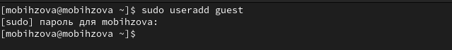{#fig:001 width=70%}

## Атрибуты файлов

2. Далее задаю пароль для созданной учетной записи (рис. 2).

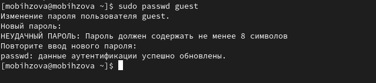{#fig:002 width=70%}

## Атрибуты файлов

3. Сменяю пользователя в системе на только что созданного пользователя guest (рис. 3).

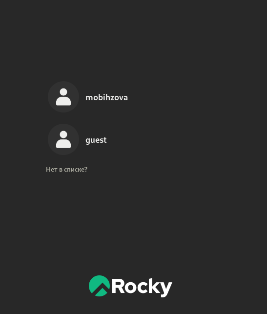{#fig:003 width=10%}

## Атрибуты файлов

4. Определяю с помощью команды pwd, что я нахожусь в директории /home/guest/. Эта директория является домашней, ведь в приглашении командой строкой стоит значок ~, указывающий, что я в домашней директории (рис. 4).

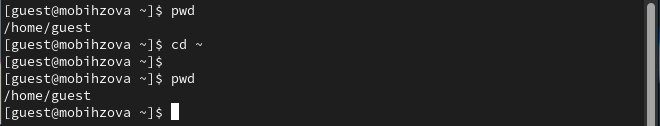{#fig:004 width=70%}

## Атрибуты файлов

5. Уточняю имя пользователя (рис. 5)

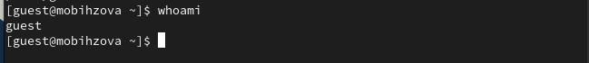{#fig:005 width=70%}

## Атрибуты файлов

6. В выводе команды groups информация только о названии группы, к которой относится пользователь. В выводе команды id можно найти больше информации: имя пользователя и имя группы, также коды имени пользователя и группы  (рис. 6)

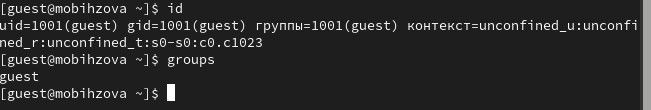{#fig:006 width=70%}

## Атрибуты файлов

7. Имя пользователя в приглашении командной строкой совпадает с именем пользователя, которое выводит команда whoami (рис. 7)

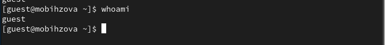{#fig:007 width=70%}

## Атрибуты файлов

8. Получаю информацию о пользователе с помощью команды 
```
cat /etc/passwd | grep guest
```

В выводе получаю коды пользователя и группы, адрес домашней директории (рис. 8).

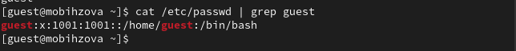{#fig:008 width=70%}

## Атрибуты файлов

9. Да, список поддиректорий директории home получилось получить с помощью команды ls -l, если мы добавим опцию -a, то сможем увидеть еще и директорию пользователя root. Права у директории:

root: drwxr-xr-x,

evdvorkina и guest: drwx------ (рис. 9).

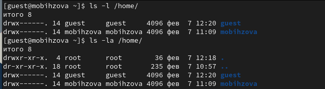{#fig:009 width=70%}

## Атрибуты файлов

10. Пыталась проверить расширенные атрибуты директорий. Нет, их увидеть не удалось (рис. 10). Увидеть расширенные атрибуты других пользователей, тоже не удалось, для них даже вывода списка директорий не было.

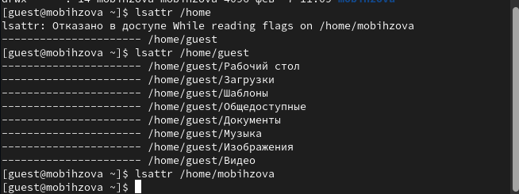{#fig:010 width=70%}

## Атрибуты файлов

11. Создаю поддиректорию dir1 для домашней директории. Расширенные атрибуты командой lsattr просмотреть у директории не удается, но атрибуты есть: drwxr-xr-x, их удалось просмотреть с помощью команды ls -l (рис. 11).

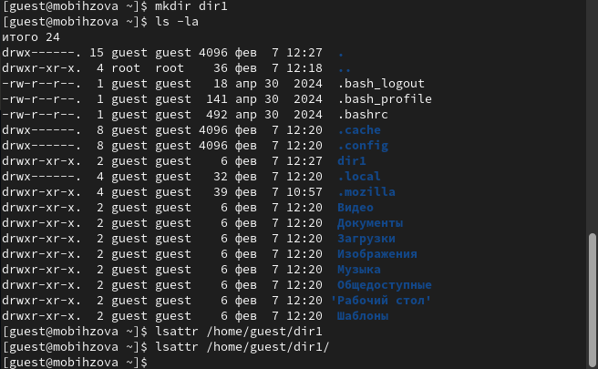{#fig:011 width=40%}

## Атрибуты файлов

12. Снимаю атрибуты командой chmod 000 dir1, при проверке с помощью команды ls -l видно, что теперь атрибуты действительно сняты (рис. 12).
 
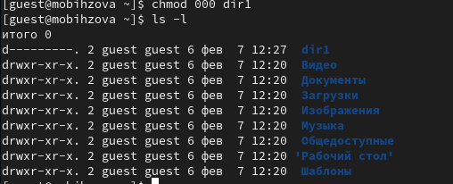{#fig:012 width=70%}

## Атрибуты файлов

13. Попытка создать файл в директории dir1. Выдает ошибку: "Отказано в доступе" (рис. 13). 

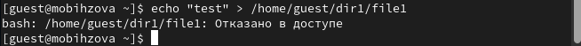{#fig:013 width=70%}

## Атрибуты файлов

Вернув права директории и использовав снова командy ls -l можно убедиться, что файл не был создан (рис. 14). 

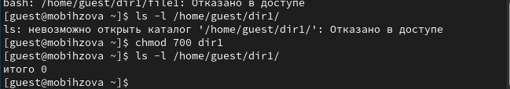{#fig:014 width=70%}

## Выводы

Были получены практические навыки работы в консоли с атрибутами файлов, закреплены теоретические основы дискреционного разграничения доступа в современных системах с открытым кодом на базе ОС Linux.
