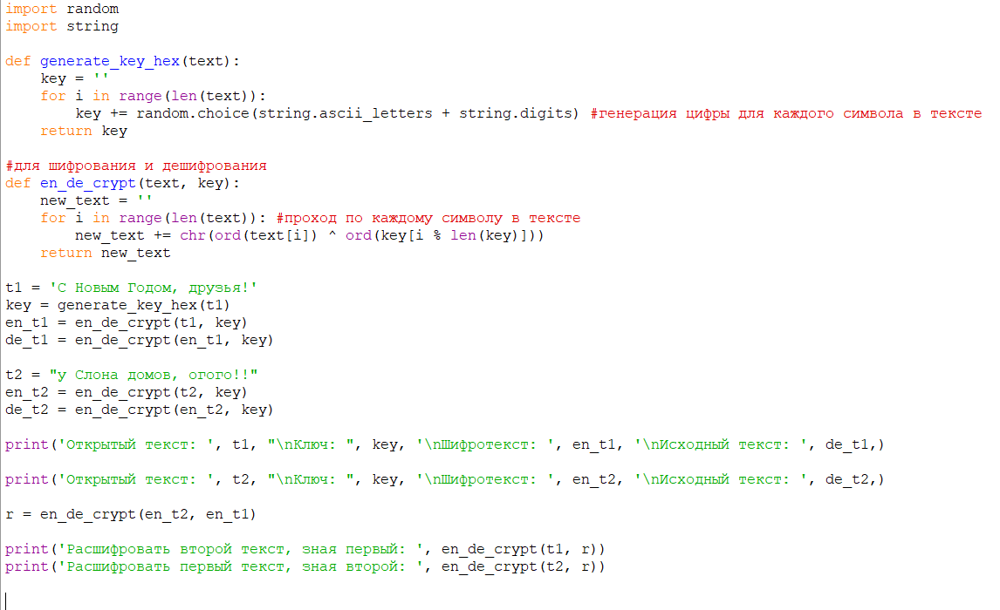
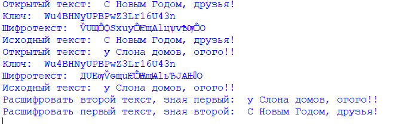

---
## Front matter
lang: ru-RU
title: Презентация по лабораторной работе №1
subtitle: Основы информационной безопасности
author:
  - Бызова М.О.
institute:
  - Российский университет дружбы народов, Москва, Россия
date: 22 апреля 2025

## i18n babel
babel-lang: russian
babel-otherlangs: english

## Fonts
mainfont: PT Serif
romanfont: PT Serif
sansfont: PT Sans
monofont: PT Mono
mainfontoptions: Ligatures=TeX
romanfontoptions: Ligatures=TeX
sansfontoptions: Ligatures=TeX,Scale=MatchLowercase
monofontoptions: Scale=MatchLowercase,Scale=0.9

## Formatting pdf
toc: false
toc-title: Содержание
slide_level: 2
aspectratio: 169
section-titles: true
theme: metropolis
header-includes:
 - \metroset{progressbar=frametitle,sectionpage=progressbar,numbering=fraction}
 - '\makeatletter'
 - '\beamer@ignorenonframefalse'
 - '\makeatother'
---

# Информация

## Цель

Освоить на практике применение режима однократного гаммирования
на примере кодирования различных исходных текстов одним ключом

## Задание

Два текста кодируются одним ключом (однократное гаммирование).
Требуется не зная ключа и не стремясь его определить, прочитать оба текста. Необходимо разработать приложение, позволяющее шифровать и дешифровать тексты $P_1$ и $P_2$ в режиме однократного гаммирования. Приложение должно определить вид шифротекстов $C_1$ и $C_2$ обоих текстов $P_1$ и
P2 при известном ключе; Необходимо определить и выразить аналитически способ, при котором злоумышленник может прочитать оба текста, не
зная ключа и не стремясь его определить.

## Выполнение лабораторной работы

Я выполняла лабораторную работу на языке программирования Python, используя функции, реализованные в лабораторной работе №7.

## Выполнение лабораторной работы

Используя функцию для генерации ключа, генерирую ключ, затем шифрую два разных текста одним и тем же ключом 

{#fig:001 width=40%}

## Выполнение лабораторной работы

Расшифровываю оба текста сначала с помощью одного ключа, затем предполагаю, что мне неизвестен ключ, но извествен один из текстов и уже расшифровываю второй, зная шифротексты и первый текст 

{#fig:002 width=70%}

## Вывод

В ходе лабораторной работы были освоины на практике навыки применения режима однократного гаммирования на примере кодирования различных исходных текстов одним ключом.

