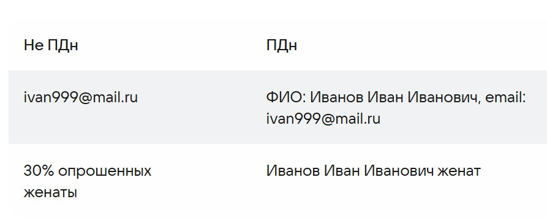
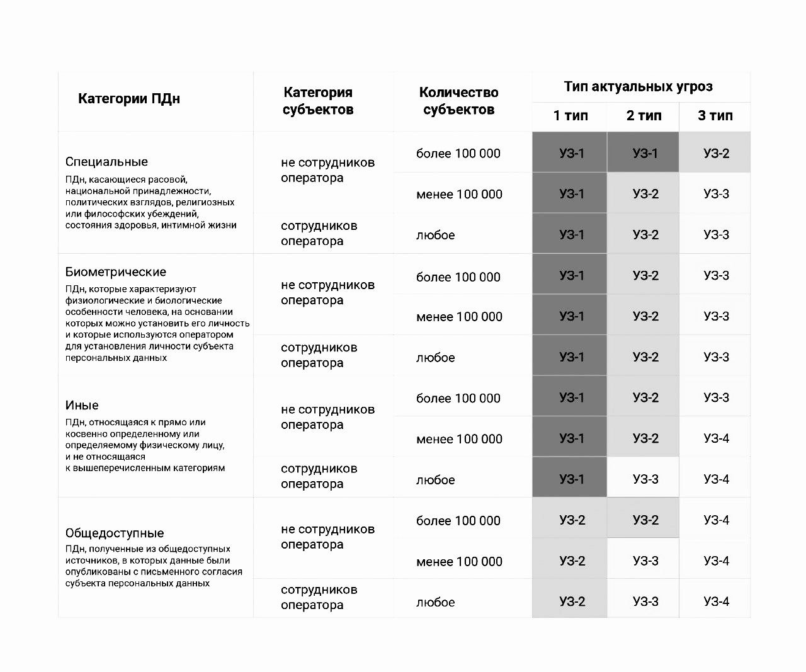
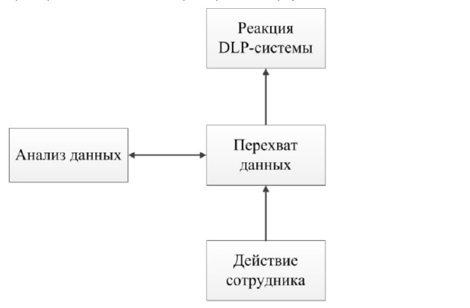
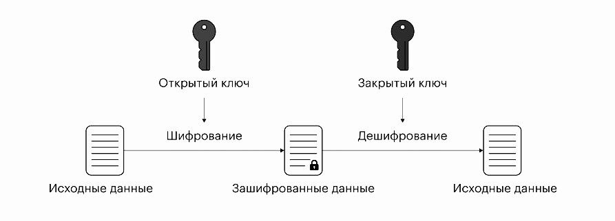

---
## Front matter
lang: ru-RU
title: "Доклад"
subtitle: Защита персональных данных в социальных сетях.
author:
   - Бызова Мария Олеговна.
institute:
  - Российский университет дружбы народов, Москва, Россия
date: 03 апреля 2025

## i18n babel
babel-lang: russian
babel-otherlangs: english

## Formatting pdf
toc: false
toc-title: Содержание
slide_level: 2
aspectratio: 169
section-titles: true
theme: metropolis
header-includes:
 - \metroset{progressbar=frametitle,sectionpage=progressbar,numbering=fraction}
 
## Fonts 
mainfont: PT Serif 
romanfont: PT Serif 
sansfont: PT Sans 
monofont: PT Mono 
mainfontoptions: Ligatures=TeX 
romanfontoptions: Ligatures=TeX 
sansfontoptions: Ligatures=TeX,Scale=MatchLowercase 
monofontoptions: Scale=MatchLowercase,Scale=0.9 
---

## Докладчик

:::::::::::::: {.columns align=center}
::: {.column width="70%"}

  * Бызова Мария Олеговна
  * Студент
  * Российский университет дружбы народов
  * 1132236129@pfur.ru

:::
::: {.column width="50%"}

{#fig:001 width=70%}

:::
::::::::::::::

## Актуальность темы и проблема.

Социальные сети нуждаются в надежных системах защиты данных, чтобы предотвратить утечки и злоупотребление личной информацией. Анализ современных угроз и разработка новых методов шифрования и контроля доступа критически важны для решения этой задачи.

## Объект и предмет исследования

Объектом исследования данного доклада являются процессы обеспечения информационной безопасности в социальных сетях.

Предмет исследования – методы и средства защиты персональных данных пользователей социальных сетей от несанкционированного доступа, утечек и иных угроз информационной безопасности.

## Цель

Целью данного доклада является анализ угроз безопасности персональных данных в социальных сетях, а также изучение и систематизация методов их защиты для обеспечения конфиденциальности и минимизации рисков утечки информации.

## Задачи исследования

Задачи исследования включают анализ угроз безопасности персональных данных в социальных сетях, изучение методов и технологий их защиты, а также оценку эффективности существующих механизмов предотвращения утечек и несанкционированного доступа.

## Материалы, методы и инструменты исследования

Учебные пособия и книги, интернет-ресурсы и аналитика.

## Введение

Социальные сети стали неотъемлемой частью нашей жизни, но их активное использование ведет к рискам утечки персональных данных. Пользователи часто не осознают, насколько уязвима их информация, а даже крупные платформы не всегда обеспечивают надежную защиту. Решение этой проблемы требует как технологических мер, так и повышения цифровой грамотности, потому что, чтобы снизить риски, нужны не только технические решения, но и осознанное поведение самих пользователей.

# Понятие персональных данных (ПДн)

## Нормативная база вопроса персональных данных

:::::::::::::: {.columns align=center}
::: {.column width="60%"}

Основные документы, регулирующие обработку персональных данных в РФ:
                          
* Международные: 
   * Конвенция Совета Европы ETS № 108 (1981/1999).
* Национальные: 
   * Конституция РФ (ст. 23-24)
   * 152-ФЗ «О персональных данных» (2006)
   * Постановления Правительства (№ 1119, 512, 687, 211)
   * Приказы ФСБ (№ 378) и ФСТЭК (№ 21)
:::
::: {.column width="40%"}

:::
::::::::::::::

## Понятие персональных данных

:::::::::::::: {.columns align=center}
::: {.column width="70%"}
                          
***
Персональные данные - любая информация, относящаяся к прямо или косвенно определенному или определяемому физическому лицу (субъекту персональных данных).

Что считается ПДн? Любая информация, позволяющая идентифицировать человека:

* ФИО, фото, паспортные данные
* Контакты (телефон, email)
* Адрес, местоположение
* Профессиональные данные

Ключевой принцип: Данные становятся персональными только при возможности однозначно связать их с конкретным человеком.

:::
::: {.column width="30%"}

:::
::::::::::::::

## Классификация ПДн

:::::::::::::: {.columns align=center}
::: {.column width="50%"}

* Общие (общедоступные)
   * ФИО, телефон, email, место работы, адрес
   * Могут быть известны другим лицам (соцсети, открытые источники)

* Специальные
   * Раса, религия, политика, здоровье, судимость, личная жизнь
   * Защищены законом, доступны только с согласия

:::
::: {.column width="50%"}

* Биометрические
   * Фото, отпечатки пальцев, ДНК, группа крови
   * Используются для идентификации (например, распознавание лиц)

* Иные
   * Членство в клубах, зарплата, стаж, отпуска
   * Дополнительная информация, не относящаяся к другим категориям

:::
::::::::::::::

## Классификация ПДн

{width=50%}

## Оператор и субъект персональных данных

Оператор ПДн — это организация, осуществляющая сбор, хранение, обработку и распространение персональных данных. В соответствии с Федеральным законом № 152-ФЗ, под хранением данных понимается их физическое или электронное хранение на серверах, в базах данных или даже в бумажном виде. Примеры хранения включают размещение информации на облачных ресурсах или в архивных папках.

Субъект персональных данных — это физическое лицо, чьи персональные данные обрабатываются оператором. Например, когда человек заполняет анкету для получения карты постоянного покупателя, он становится субъектом ПДн, а магазин, собирающий эти данные, — оператором. 

## Защита персональных данных оператором

Согласно 152-ФЗ оператор должен обеспечить защиту персональных данных.

:::::::::::::: {.columns align=center}
::: {.column width="55%"}

***
Степень защиты зависит от типа данных:

* Общедоступные – минимальная защита
* Иные – защита выше, известны ограниченному кругу лиц
* Биометрические – высокий уровень защиты (используются для идентификации)
* Специальные – максимальная защита (могут нанести вред человеку)

:::
::: {.column width="45%"}

***
Ключевые требования к оператору:

* Построение защищенной IT-инфраструктуры
* Обеспечение доступности, целостности и конфиденциальности данных
* Обработка данных только с согласия субъекта
* Отчетность перед государством

:::
::::::::::::::

## Защита персональных данных оператором

Защита персональных данных зависит от установленного законом уровня защищенности (УЗ), определяемого типом данных и потенциальными угрозами. Данные с УЗ-3 и УЗ-4 можно хранить в облаке, аттестованном по 152-ФЗ, а для УЗ-2 и УЗ-1 требуются специальные условия, доступные не у всех провайдеров.

{width=50%}

# Проблема защиты личных данных в социальных сетях

## Проблема защиты личных данных в социальных сетях 

Защита личной информации в социальных сетях представляет собой комплексную проблему, выходящую за рамки простой передачи данных при регистрации. Основная сложность заключается в том, что пользователи часто неосознанно раскрывают конфиденциальную информацию - не только базовые данные (имя, email), но и компрометирующие сведения, которые могут быть использованы злоумышленниками. Особую озабоченность вызывает вопрос интеллектуальной собственности, поскольку размещаемый пользователями контент (фото, видео, тексты) становится доступным широкой аудитории. Социальные сети внедряют системы защиты (например, алгоритм "Немезида" во ВКонтакте), но этого недостаточно для полного предотвращения нарушений. 

## Проблема защиты личных данных в социальных сетях 

Защита личной информации в социальных сетях обеспечивается через следующие меры:

1. Предотвращение несанкционированного доступа к информации.
2. Выявление случаев несанкционированного доступа и расследование причин утечки данных.
3. Восстановление информации, уничтоженной или измененной в результате несанкционированного доступа.

## Проблема защиты личных данных в социальных сетях 

Социальные сети обеспечивают защиту данных через многоуровневую систему, включающую технические и организационные меры.

Программные средства включают:

1. DLP-системы.
2. SIEM-системы
3. Криптографические средства

На организационном уровне действует принцип "соответствия целей обработки", запрет передачи данных третьим лицам и прозрачная политика конфиденциальности.

# Меры по защите личных данных в социальных сетях 

## DLP-системы 

:::::::::::::: {.columns align=center}
::: {.column width="60%"}

***
DLP (Data Loss Prevention) - комплексное программное решение для предотвращения утечек конфиденциальной информации через мониторинг, анализ и блокировку подозрительных действий.

Как работает?

* Идентификация конфиденциальной информации.
* Мониторинг активности пользователей.
* Предотвращение утечек.

:::
::: {.column width="40%"}

:::
::::::::::::::

## DLP-системы 

DLP-системы анализируют данные для предотвращения утечек, получая их двумя способами: серверным (контроль сетевого трафика) и агентским (установка агентов на компьютеры для сбора данных). Агентский перехват более распространен, так как обеспечивает более полный сбор данных и надежнее предотвращает утечки.

Использование DLP-систем позволяет организациям не только защитить свою информацию, но и соответствовать требованиям законодательства в области защиты персональных данных. Таким образом, внедрение таких решений становится важным шагом для обеспечения информационной безопасности и сохранения репутации компании на рынке.

## SIEM-системы

Система управления информационной безопасностью и событиями (SIEM) — это важный инструмент, предназначенный для повышения уровня безопасности в организациях. SIEM объединяет функции управления информационной безопасностью (SIM) и управления событиями безопасности (SEM), позволяя собирать, анализировать и реагировать на угрозы в реальном времени.

Основные функции SIEM включают:

1. Сбор данных.
2. Корреляция событий.
3. Управление инцидентами.

## Средства криптографической защиты информации (СКЗИ)

Средства криптографической защиты информации (СКЗИ) представляют собой программы и устройства, предназначенные для обеспечения конфиденциальности, целостности и доступности данных. Основная цель СКЗИ заключается в защите информации от несанкционированного доступа, а также в обеспечении ее безопасности как при хранении, так и при передаче.

## Средства криптографической защиты информации (СКЗИ)

СКЗИ включают в себя различные методы и алгоритмы шифрования, среди которых выделяются:

Симметричное шифрование: метод, при котором для зашифровки и расшифровки данных используется один и тот же ключ. Этот подход прост в реализации, но требует надежного хранения ключа. Обычно таким образом шифруют данные в состоянии покоя.

{width=50%}

## Средства криптографической защиты информации (СКЗИ)

Асимметричное шифрование: предполагает использование пары ключей — открытого для шифрования и закрытого для расшифровки. При асимметричной криптографии данные шифруются одним ключом и расшифровываются другим. Причём ключ для шифрования обычно открытый, а для дешифровки — закрытый. 

{width=50%}

## Средства криптографической защиты информации (СКЗИ)

Гибридное шифрование: сочетает в себе оба подхода, обеспечивая баланс между безопасностью и производительностью. Данные шифруются симметрично, а ключ для доступа к ним передается с использованием асимметричного шифрования. 

{width=50%}

## Средства криптографической защиты информации (СКЗИ)

Хеш-функции играют важную роль в обеспечении целостности данных, что делает их полезными для проверки внесённых изменений. Так одной из распространённых практик является хранение паролей пользователей не в открытом виде, а в их хешированном формате. При авторизации пользователь вводит свой пароль, который затем хешируется и сравнивается с хешем, хранящимся в базе данных. Если хеши совпадают, это удостоверяет правильность введённого пароля.

{width=50%}

# Рекоммендации по защите персональных данных в социальных сетях

## Рекоммендации по защите персональных данных в социальных сетях

Для защиты персональных данных в социальных сетях необходимо соблюдать ряд мер предосторожности.

:::::::::::::: {.columns align=center}
::: {.column width="50%"}

* Сложные пароли. 
* Ограничение публикации личной информации.
* Безопасность фотографий.
* Настройки конфиденциальности.
* Безопасные интернет-браузеры.
* Осторожность при переходе по ссылкам.

:::
::: {.column width="50%"}

* Проверка установленных приложений.
* Осторожность при онлайн-общении.
* Безопасность интернет-знакомств.
* Безопасное подключение к Wi-Fi.
* Использование только проверенных источников для загрузки файлов.

:::
::::::::::::::

## Заключение 

Защита персональных данных в соцсетях важна из-за роста киберугроз. Пользователям следует использовать сложные пароли, двухфакторную аутентификацию, настраивать конфиденциальность и быть осторожными с незнакомцами. Правовое регулирование и осведомленность о базовых мерах безопасности помогают минимизировать риски и сохранить конфиденциальность.

## Список литературы

1. Федеральный закон от 27.07.2006 N 152-ФЗ (ред. от 06.02.2023) "О персональных данных.
2. Исаев А.С., Хлюпина Е.А. «Правовые основы организации защиты персональных данных» – СПб: НИУ ИТМО, 2014. – 106 с.
3. Основы обеспечения безопасности персональных данных в организации [Текст] : учеб. пособие / Д. М. Назаров, 
К. М. Саматов ; М-во науки и высш. образования Рос. Федерации, Урал. гос. экон. ун-т. — Екатеринбург : Изд-во Урал. гос. экон. ун-та, 2019. — 118 c.
4. Практическая психология безопасности. Управление персональными данными в интернете: учеб.-метод. пособие для работников системы общего образования / Г.У. Солдатова, А.А. Приезжева, О.И. Олькина, В.Н. Шляпников. — М.: Генезис, 2017. — 224 с.

