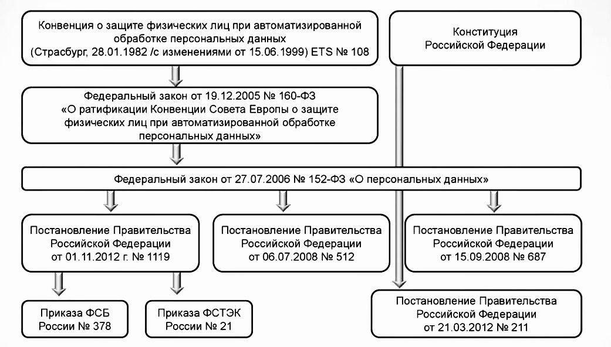
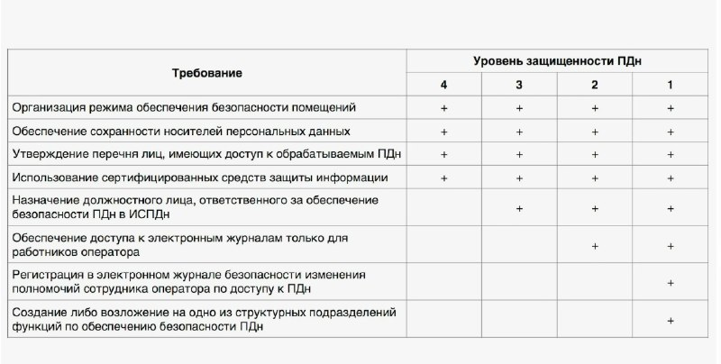
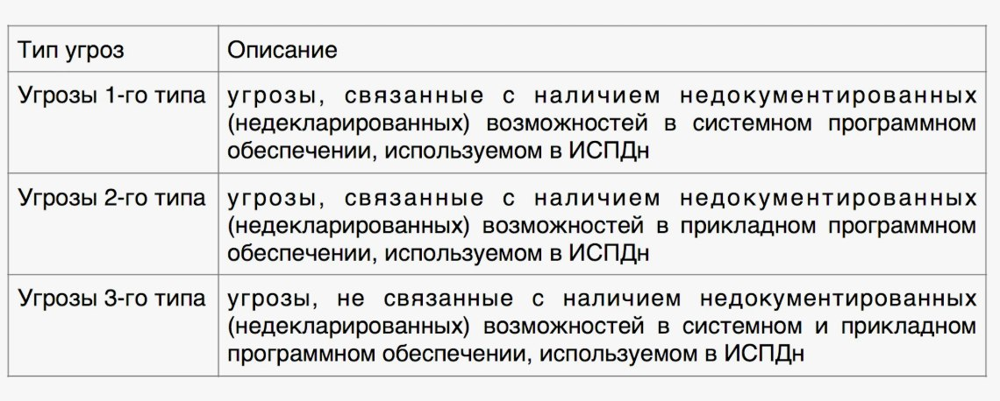
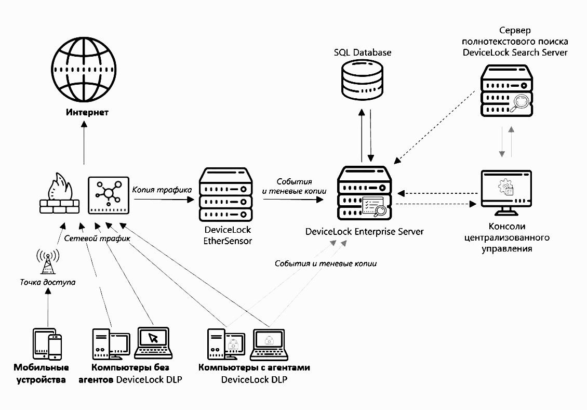
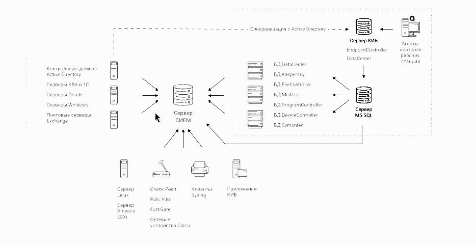
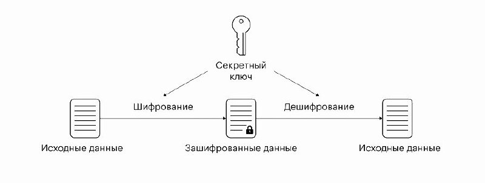
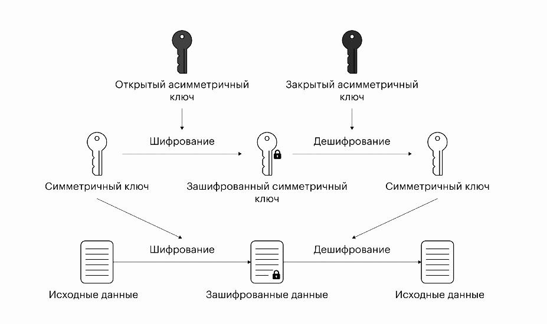

---
## Front matter
title: "Доклад"
subtitle: "Защита персональных данных в социальных сетях"
author: "Бызова Мария Олеговна"

## Generic otions
lang: ru-RU
toc-title: "Содержание"

## Bibliography
bibliography: bib/cite.bib
csl: pandoc/csl/gost-r-7-0-5-2008-numeric.csl

## Pdf output format
toc: true # Table of contents
toc-depth: 2
lof: true # List of figures
lot: true # List of tables
fontsize: 12pt
linestretch: 1.5
papersize: a4
documentclass: scrreprt
## I18n polyglossia
polyglossia-lang:
  name: russian
  options:
	- spelling=modern
	- babelshorthands=true
polyglossia-otherlangs:
  name: english
## I18n babel
babel-lang: russian
babel-otherlangs: english
## Fonts
mainfont: IBM Plex Serif
romanfont: IBM Plex Serif
sansfont: IBM Plex Sans
monofont: IBM Plex Mono
mathfont: STIX Two Math
mainfontoptions: Ligatures=Common,Ligatures=TeX,Scale=0.94
romanfontoptions: Ligatures=Common,Ligatures=TeX,Scale=0.94
sansfontoptions: Ligatures=Common,Ligatures=TeX,Scale=MatchLowercase,Scale=0.94
monofontoptions: Scale=MatchLowercase,Scale=0.94,FakeStretch=0.9
mathfontoptions:
## Biblatex
biblatex: true
biblio-style: "gost-numeric"
biblatexoptions:
  - parentracker=true
  - backend=biber
  - hyperref=auto
  - language=auto
  - autolang=other*
  - citestyle=gost-numeric
## Pandoc-crossref LaTeX customization
figureTitle: "Рис."
tableTitle: "Таблица"
listingTitle: "Листинг"
lofTitle: "Список иллюстраций"
lotTitle: "Список таблиц"
lolTitle: "Листинги"
## Misc options
indent: true
header-includes:
  - \usepackage{indentfirst}
  - \usepackage{float} # keep figures where there are in the text
  - \floatplacement{figure}{H} # keep figures where there are in the text
---

# Вводная часть

## Актуальность темы и проблема

Актуальность темы, посвященной защите персональных данных в социальных сетях, обусловлена тем, что с каждым днём количество цифровых технологий стремительно растет, и объем информации, хранящийся в онлайн-сервисах, увеличивается вместе с ним. Сегодня социальные сети уже считаются интегрированными в повседневную жизнь, и многие пользователи обычно используют их даже в своей профессиональной деятельности, однако их неграмотное использование может привести к рискам несанкционированного доступа, утечки и неправомерного использования персональных данных пользователей.

Проблема заключается в необходимости обеспечения конфиденциальности и безопасности персональных данных пользователей, размещаемого в социальных сетях, а также инициирования действенных механизмов страховки от киберугроз. Несмотря на наличие различных способов регулирования и технических средств защиты, риски утечки информации, взлома аккаунтов и использования личных данных в мошеннических целях остаются, что делает актуальным изучение данной темы и поиск решений для повышения уровня информационной безопасности пользователей социальных сетей.

## Объект и предмет исследования

Объектом исследования данного доклада являются процессы обеспечения информационной безопасности в социальных сетях.

Предмет исследования – методы и средства защиты персональных данных пользователей социальных сетей от несанкционированного доступа, утечек и иных угроз информационной безопасности.

## Цель

Целью данного доклада является анализ угроз безопасности персональных данных в социальных сетях, а также изучение и систематизация методов их защиты для обеспечения конфиденциальности и минимизации рисков утечки информации.

## Задачи исследования

Задачи исследования включают анализ угроз безопасности персональных данных в социальных сетях, изучение методов и технологий их защиты, а также оценку эффективности существующих механизмов предотвращения утечек и несанкционированного доступа.

## Материалы, методы и инструменты исследования

Учебные пособия и книги, интернет-ресурсы и аналитика.

# Введениe

В эпоху повсеместной глобализации и цифровизации социальные сети стали неотъемлемой частью жизни пользователей и важным инструментом взаимодействия, выполняющим множество функций. Сегодня социальные сети играют роль от средств коммуникации до платформ для профессионального продвижения и распространения информации. Однако с ростом их популярности и функциональности увеличивает и число потенциальных рисков, связанных с угрозами конфиденциальности и неправомерным использованием персональных данных пользователей.

Регистрация и использование социальных сетей требуют от пользователей предоставления значительного объема информации, включая не только базовые личные данные (ФИО, возраст, место жительства), но и более чувствительную и личную информацию, например, контакты, предпочтения, местоположение, а также историю поиска и переписок. Кроме того, многие пользователи оставляют собственные фотографии, публикуют сведения о своей профессиональной деятельности и образе жизни на своих страницах в социальных сетях и в личной переписке. Уделяя так много времени социальным сетям, практически невозможно не оставить после себя цифрового следа в Интернете, что создает благоприятные условия для злоумышленников, желающих использовать наши находящиеся в свободном доступе данные в корыстных целях.

Кроме того не менее важным остается вопрос осведомленности пользователей о возможных угрозах, связанных с конфиденциальностью - заботиться о том, чтобы нашей персональной информацией не воспользовались злоумышленники, стоит не только соцсетям, но и самим пользователям. Люди часто недооценивают степень уязвимости своих данных, которые, будучи собранными злоумышленниками из открытых источников, могут стать инструментом для социальной инженерии, мошенничества или кражи личности. По данным социальных опросов, только 40% пользователей сети Интернет в России знают, как ограничить доступ к персональным данным, и понимают, для чего это нужно. Более того, случаи утечек данных с крупных платформ, таких как, например, "ВКонтакте", подчеркивают тот факт, что даже масштабные корпорации не всегда обеспечивают должный уровень информационной безопасности, что усугубляет проблему и для конечных пользователей.

Учитывая эти обстоятельства, обеспечение безопасности персональных данных пользователей в социальных сетях приобретает все большее значение. Актуальность данной проблемы требует комплексного подхода, включающего технологические решения со стороны разработчиков Интернет-ресусов, повышение уровня цифровой грамотности пользователей социальных сетей, а также соблюдение и развитие законодательных норм. В рамках доклада мной будут подробно проанализированы ключевые угрозы, предложены способы минимизации рисков, а также даны практические рекомендации, направленные на усиление защиты персональных данных и обеспечение конфиденциальности в условиях современного цифрового пространства.

# Персональные данные (ПДн).

Прежде чем приступить к анализу проблем, связанных с конфиденциальностью персональных данных (ПДн) пользователей социальных сетей, разберёмся, что может считаться ПДн, какими они бывают и как можно постараться обезопасить себя в Интернете согласно 152-ФЗ "О персональных данных" (рис. [-@fig:001]).

{#fig:001 width=70%}

## Понятие персональных данных. 

Персональные данные - любая информация, относящаяся к прямо или косвенно определенному или определяемому физическому лицу (субъекту персональных данных). Например, ФИО, мобильный телефон, email, адрес проживания, фотография, паспортные данные — всё это ПДн.

Персональные данные должны быть непосредственно связаны с конкретным физическим лицом, чтобы подлежать классификации как таковые. Например, просто указанный электронный адрес или номер телефона не могут быть признаны персональными данными, поскольку отсутствует возможность однозначной идентификации владельца. Однако в ситуациях, когда в базе данных компании зафиксированы фамилия, имя, отчество клиента, а также его электронный адрес и телефонный номер, эти контактные данные уже становятся персональными, так как они напрямую позволяют установить связь с определенной личностью. Аналогичный подход применяется к результатам анкетирования. В тех случаях, когда опрос проводится анонимно, и респонденты предоставляют информацию о своем семейном положении без идентификации, такие сведения не считаются персональными данными. Напротив, если в ходе опроса собираются ФИО, номер телефона и информация о семейном статусе, то согласно законодательству данные становятся персональными и подлежат соответствующей защите.

## Классификация персональных данных. 

Согласно Постановлению Правительства РФ от 01.11.2012 N 1119 "Об утверждении требований к защите персональных данных при их обработке в информационных системах персональных данных" можно выделить четыре основные категории, на которые можно разделить все персональные данные: общие (или общедоступные), специальные, биометрические и иные (рис. [-@fig:002]).

К общим персональным данным согласно законодательству относятся основные сведения, идентифицирующие личность человека. Сюда входят такие данные, как фамилия, имя и отчество (ФИО), место регистрации, информация о месте трудовой деятельности, номер телефона, а также адрес электронной почты. Эти данные зачастую известны другим лицам и могут быть доступны в открытых источниках, таких как социальные сети. Например, друзья и знакомые могут легко узнать место работы человека через его профиль в социальной сети.

Специальные персональные данные представляют собой информацию, касающуюся личной сферы человека. К таким данным относятся расовая или этническая принадлежность, политические и религиозные взгляды, состояние здоровья, а также подробности интимной жизни и наличие судимостей. Особенность специальных категорий данных заключается в том, что они обычно находятся в закрытом доступе. Получить такую информацию можно лишь либо непосредственно от самого человека, либо через официальные запросы в соответствующие органы, такие как больницы, правоохранительные учреждения или судебные инстанции. Чаще всего предоставление таких данных является правом, а не обязанностью субъекта.

Биометрические персональные данные охватывают физиологические и биологические характеристики, которые используют для идентификации личности. К ним могут относиться фотографии, отпечатки пальцев, группа крови и генетическая информация. Однако не все эти данные автоматически признаются биометрическими. В соответствии с разъяснением правительства, данные становятся биометрическими только в том случае, если они хранятся с целью идентификации. Например, если на проходной организации установлена система распознавания лиц, фотографии сотрудников будут классифицироваться как биометрические данные, поскольку их использование предполагает идентификацию личности. В то же время, если фотография уже известного сотрудника прикреплена к его личному делу, такие данные не могут считаться биометрическими, поскольку они не предназначены для идентификации.

Иные персональные данные относятся ко всему, что не подлежит отнесению к общим, специальным или биометрическим данным. К этой категории относятся сведения о принадлежности к определенным социальным группам, например, членство в клубах, а также корпоративные данные, такие как информация о зарплате, сроках отпусков и трудовом стаже, которая хранится в бухгалтерии.

Разграничение между специальными и иными данными может быть сложным. Специальные данные, как правило, характеризуют человека и часто предполагают необходимость защиты их конфиденциальности от посторонних. В отличие от этого, иные данные представляют собой дополнительную информацию, которая может меняться и не обязательно связана с личностью человека в той же степени.

{#fig:002 width=100%}

## Оператор и субъект персональных данных 

В контексте законодательства о защите персональных данных ключевыми понятиями являются оператор и субъект персональных данных.

Оператор ПДн — это организация, осуществляющая сбор, хранение, обработку и распространение персональных данных. В соответствии с Федеральным законом № 152-ФЗ, под хранением данных понимается их физическое или электронное хранение на серверах, в базах данных или даже в бумажном виде. Примеры хранения включают размещение информации на облачных ресурсах или в архивных папках.

Обработка персональных данных охватывает широкий спектр действий: от записи и извлечения до анализа, изменения, передачи и удаления информации. Условие обработки данных выполняется даже на этапе их первичного сбора.

Субъект персональных данных — это физическое лицо, чьи персональные данные обрабатываются оператором. Например, когда человек заполняет анкету для получения карты постоянного покупателя, он становится субъектом ПДн, а магазин, собирающий эти данные, — оператором.

В рамках организаций данные обрабатываются с учетом особенности каждого субъекта. Так, доступ к данным сотрудников может иметь один круг пользователей, в то время как доступ к информации о клиентах находится в ведении других. Поэтому в правилах обработки персональных данных в компаниях важно выделять различные категории субъектов, такие как сотрудники, клиенты, стажеры и представители клиентов.

## Защита персональных данных оператором

Согласно 152-ФЗ оператор должен обеспечить защиту персональных данных. Степень защиты зависит от типа данных:

1. Общедоступные нуждаются в самой слабой защите — их довольно легко получить, обычно их не скрывают.
2. Иные данные нужно защищать чуть сильнее — они известны меньшему кругу лиц.
3. Биометрические данные защищают еще серьезнее, поскольку их можно использовать для идентификации человека.
4. В самой серьезной защите нуждаются специальные данные — их часто можно использовать, чтобы навредить человеку.

Для защиты персональных данных по 152-ФЗ оператор должен построить защищенную IT-инфраструктуру и следить, чтобы ПДн всегда были доступны, не потерялись и не попали в руки посторонних.

Кроме защиты данных, оператор обязан собирать, обрабатывать и передавать данные куда-либо только с согласия их владельца, а также отчитываться о сборе данных и мерах защиты перед государством. То, какую защиту нужно обеспечить персональным данным, зависит от уровня защищенности (УЗ), установленного законом. Его определяют с учетом того, какие данные вы храните и что может им угрожать. Всего уровней защищенности четыре: данные с УЗ-3 и УЗ-4 можно без проблем хранить в публичном облаке, аттестованном по 152-ФЗ, для УЗ-2 и УЗ-1 нужны особые условия, не все провайдеры могут их предоставить (рис. [-@fig:003]).

{#fig:003 width=100%}

# Проблема защиты личных данных в социальных сетях 

Защита личных данных в социальных сетях представляет собой более сложную и многогранную проблему, чем это может представлять большинство пользователей. Проблема не ограничивается лишь передачей базовых данных, таких как электронная почта, имя и фамилия, при регистрации. Значительное беспокойство вызывают и те материалы, которые пользователи размещают на своих страницах. Невольно можно предоставить злоумышленникам компрометирующую информацию или сведения, которые могут быть использованы с целью причинения вреда.

Кроме того, важно учитывать аспекты интеллектуальной собственности. Контент, размещенный в социальных сетях, включая тексты, иллюстрации, аудио- и видеоматериалы, становится доступным широкому кругу лиц. Социальные платформы, в свою очередь, принимают меры по борьбе с нарушениями авторских прав. Например, начиная с 2018 года во ВКонтакте действует уникальный алгоритм «Немезида», который отслеживает публикации неоригинального контента.

Информация о правилах безопасности в социальных сетях в отношении персональных данных обычно доступна в разделе «Политика конфиденциальности». В этом разделе указаны требования к предоставлению информации, способы ее использования, меры по защите данных и рекомендации по действиям в случае нарушения конфиденциальности, например, в случае взлома аккаунта. Таким образом, пользователям следует внимательно ознакомиться с этими правилами, чтобы защитить свои данные и права на интеллектуальную собственность.

Социальные сети представляют собой сервисы, основной целью которых является создание условий для общения пользователей и доступа к необходимому контенту. В этом контексте персональные данные и активность пользователей анализируются алгоритмами с целью оптимизации пользовательского опыта. Это позволяет показать пользователям наиболее интересные для них посты, людей и рекламу. Такие действия ведутся в соответствии с законодательством, что отражается в политике конфиденциальности, где указывается принцип «соответствия целей обработки персональных данных целям, заранее определенным и заявленным при сборе».

Обработка персональных данных осуществляется на основе ключевых принципов: законности и добросовестности. Социальные сети гарантируют, что личные данные пользователей не передаются третьим лицам. Рекламодатели могут использовать внутренние рекламные сервисы платформы для нацеливания рекламы на определенные группы пользователей, основываясь на их интересах, профессии и семейном положении. Однако, ни ВКонтакте, ни другие социальные сети не передают большие массивы пользовательских данных сторонним компаниям.

Классификация угроз персональным данным представлена на риснуке 4 (рис. [-@fig:004]).

{#fig:004 width=70%}

Защита личной информации в социальных сетях обеспечивается через следующие меры:

1. Предотвращение несанкционированного доступа к информации.
2. Выявление случаев несанкционированного доступа и расследование причин утечки данных.
3. Восстановление информации, уничтоженной или измененной в результате несанкционированного доступа.

Для достижения этих целей применяются как программные, так и криптографические средства.

Программные средства включают:

1. DLP-системы — комплексные системы, предотвращающие утечку данных.
2. SIEM-системы — системы управления событиями и информационной безопасностью, которые отслеживают события безопасности в реальном времени.

Криптографические средства применяют шифрование информации, удостоверение входа и действий на сайте, а также другие инструменты.

Несмотря на предлагаемые меры защиты, стоит отметить, что мошенники также имеют в своем распоряжении ресурсы для разработки программных решений, способных нарушить существующие системы безопасности. Базы данных пользователей становятся очень ценным активом, особенно в условиях практически повсеместной цифровизации общества, и представляют собой главный ресурс для коммерческих организаций.

# Меры по защите личных данных в социальных сетях 

## DLP-системы

DLP-система (от англ. Data Loss Prevention) это специализированное ПО, которое защищает организацию от утечек данных и гарантирует информационную безопасность. DLP-система представляет собой комплексное решение, предназначенное для защиты конфиденциальной информации от утечек и несанкционированного доступа. Основная задача таких систем заключается в мониторинге, обнаружении и предотвращении перемещения или копирования данных, которые могут представлять ценность для организации.

Основа DLP — набор правил. Они могут быть любой сложности и касаться разных аспектов работы. Если кто-то их нарушает, то ответственные лица получают уведомление. Так, например, в компании Х выявили сотрудника, который занимался майнингом криптовалют. Это было обнаружено при использовании модуля активности пользователей – отчёт показал, что рабочая станция не отключалась на ночь. После просмотра запущенных процессов выяснилось, что сотрудник перед уходом запускал процесс майнинга.

Эти системы работают на основе анализа потоков информации и применяют ряд методик для защиты данных. Ключевые функции DLP-систем включают (рис. [-@fig:005]):

1. Идентификация конфиденциальной информации: системы используют различные алгоритмы и правила для классификации данных, выходящих за пределы установленных норм.
2. Мониторинг активности пользователей: DLP-системы отслеживают действия сотрудников, помогает выявить потенциальные угрозы и недобросовестных действий.
3. Предотвращение утечек: при обнаружении подозрительной активности система может блокировать доступ к данным или уведомлять администраторов о возможной угрозе.

{#fig:005 width=70%}

Для того, чтобы анализировать данные — DLP-система предотвращения потери данных сперва должна их получить.

Есть два основных способа перехвата — серверный и агентский. В первом случае система контролирует сетевой траффик на сервере, через который компьютеры «общаются» с внешним миром. Во втором случае специальные небольшие программы — агенты — устанавливаются на все компьютеры организации и передают с каждой машины данные для анализа. Агентский перехват является более распространённым, ведь с его помощью можно получить гораздо больше данных из различных каналов коммуникации, а значит и надежнее предотвратить возможные утечки.

Использование DLP-систем позволяет организациям не только защитить свою информацию, но и соответствовать требованиям законодательства в области защиты персональных данных. Таким образом, внедрение таких решений становится важным шагом для обеспечения информационной безопасности и сохранения репутации компании на рынке.

Структурная схема DLP-системы представлена на рисунке 6 (рис. [-@fig:006]).

{#fig:006 width=70%}

## SIEM-системы

Система управления информационной безопасностью и событиями (SIEM) — это важный инструмент, предназначенный для повышения уровня безопасности в организациях. SIEM объединяет функции управления информационной безопасностью (SIM) и управления событиями безопасности (SEM), позволяя собирать, анализировать и реагировать на угрозы в реальном времени.

Основные функции SIEM включают:

1. Сбор данных: системы собирают журнал событий из различных источников, таких как приложения, устройства и серверы.
2. Корреляция событий: анализ данных позволяет выявлять взаимосвязи и аномалии, что помогает быстро идентифицировать потенциальные угрозы.
3. Управление инцидентами: SIEM отслеживает события безопасности, генерирует оповещения и проводит аудит действий, связанных с инцидентами.

Современные решения SIEM, дополненные искусственным интеллектом, обеспечивают более быстрое обнаружение и реакцию на инциденты. Эти технологии позволяют организациям не только оптимизировать безопасность, но и соответствовать требованиям законодательства в области защиты данных. Внедрение системы SIEM становится ключевым шагом для повышения устойчивости бизнеса к кибератакам.

Структурная схема SIEM-системы представлена на рисунке 7 (рис. [-@fig:007]).

{#fig:007 width=100%}

## Средства криптографической защиты информации (СКЗИ)

Средства криптографической защиты информации (СКЗИ) представляют собой программы и устройства, предназначенные для обеспечения конфиденциальности, целостности и доступности данных. Основная цель СКЗИ заключается в защите информации от несанкционированного доступа, а также в обеспечении ее безопасности как при хранении, так и при передаче.

СКЗИ включают в себя различные методы и алгоритмы шифрования, среди которых выделяются:

Симметричное шифрование: метод, при котором для зашифровки и расшифровки данных используется один и тот же ключ. Этот подход прост в реализации, но требует надежного хранения ключа. Обычно таким образом шифруют данные в состоянии покоя (рис. [-@fig:008]).

{#fig:008 width=70%}

Асимметричное шифрование: предполагает использование пары ключей — открытого для шифрования и закрытого для расшифровки. При асимметричной криптографии данные шифруются одним ключом и расшифровываются другим. Причём ключ для шифрования обычно открытый, а для дешифровки — закрытый. Открытый ключ можно передать кому угодно, а закрытый оставляют у себя и никому не сообщают. Теперь зашифровать сообщение сможет любой, у кого есть открытый ключ, а расшифровать — только владелец секретного. Этот метод обеспечивает более высокий уровень безопасности, хотя и требует больших вычислительных ресурсов (рис. [-@fig:009])

{#fig:009 width=70%}

Гибридное шифрование: сочетает в себе оба подхода, обеспечивая баланс между безопасностью и производительностью. Данные шифруются симметрично, а ключ для доступа к ним передается с использованием асимметричного шифрования. Так алгоритмы работают быстрее, чем при асимметричном подходе, а узнать ключ от сообщения сложнее, чем в симметричном (рис. [-@fig:010])

{#fig:010 width=70%}

Ключевыми компонентами СКЗИ являются также хеш-функции, которые позволяют проверить целостность данных, а также обеспечить безопасность паролей пользователя. Хеш-функции представляют собой уникальные методы криптографической защиты, отличающиеся своей необратимостью, что означает невозможность расшифровки преобразованных данных. Они генерируют строку фиксированной длины, например, 256 бит, которая известна как хеш, хеш-сумма или хеш-код. В идеальных условиях, при многократном применении одной и той же хеш-функции к одному и тому же сообщению результат будет неизменно аналогичным. Однако любое, даже минимальное, изменение оригинального сообщения приведёт к значительной вариации хеша.

Хеш-функции играют важную роль в обеспечении целостности данных, что делает их полезными для проверки внесённых изменений. Так одной из распространённых практик является хранение паролей пользователей не в открытом виде, а в их хешированном формате. При авторизации пользователь вводит свой пароль, который затем хешируется и сравнивается с хешем, хранящимся в базе данных. Если хеши совпадают, это удостоверяет правильность введённого пароля. Данная методика обеспечивает дополнительный уровень безопасности, поскольку даже при утечке базы данных злоумышленник получит лишь список хешей, восстанавливать оригинальные пароли из которых практически невозможно (рис. [-@fig:011]).

{#fig:011 width=70%}

Кроме технологических аспектов СКЗИ, важным является соблюдение правовых норм. Законодательство о защите персональных данных предписывает использование надежных средств криптографической защиты, что делает внедрение СКЗИ обязательным для организаций, работающих с конфиденциальной информацией.

# Рекоммендации по защите персональных данных в социальных сетях

Современные социальные сети предоставляют пользователям широкие возможности для общения, обмена информацией и самовыражения. Однако их использование сопряжено с серьезными рисками, связанными с утечкой и неправомерным использованием персональных данных. В условиях возрастания числа киберугроз важно соблюдать основные правила информационной безопасности, позволяющие минимизировать возможные риски.

Для защиты персональных данных в социальных сетях необходимо соблюдать ряд мер предосторожности:

1. Сложные пароли. Использование уникальных, сложных и длинных паролей для каждого аккаунта снижает вероятность взлома. Рекомендуется комбинировать буквы разных регистров, цифры и специальные символы, избегая очевидных комбинаций (дата рождения, имя и т. д.).
2. Ограничение публикации личной информации. Не следует указывать в профиле адрес проживания, номер телефона, информацию о предстоящих поездках и другие сведения, которые могут быть использованы злоумышленниками.
3. Безопасность фотографий. Перед публикацией изображений важно обращать внимание на их содержимое, чтобы исключить случайное раскрытие конфиденциальных данных (например, документов, билетов, информации о местоположении).
4. Настройки конфиденциальности. Рекомендуется ограничить доступ к личной информации, разрешая просмотр публикаций только проверенным пользователям.
5. Безопасные интернет-браузеры. Использование надежных браузеров, антивирусного программного обеспечения и брандмауэра снижает вероятность заражения вредоносными программами.
6. Осторожность при переходе по ссылкам. Необходимо избегать перехода по подозрительным ссылкам, полученным от незнакомых пользователей или в сомнительных сообщениях, так как это может привести к фишинговым атакам и компрометации аккаунта.
7. Проверка установленных приложений. Перед загрузкой приложений и предоставлением им доступа к данным важно изучить их репутацию и запрашиваемые разрешения.
8. Осторожность при онлайн-общении. Необходимо быть бдительными при переписке, так как злоумышленники могут выдавать себя за знакомых. При получении подозрительных сообщений от друзей рекомендуется связаться с ними по альтернативному каналу связи для подтверждения личности.
9. Безопасность интернет-знакомств. Добавление в друзья неизвестных пользователей и общение с ними требует осторожности, так как за фальшивыми профилями могут скрываться мошенники.
10. Использование только проверенных источников для загрузки файлов. Файлообменные платформы и сомнительные сайты могут содержать вредоносное ПО, поэтому скачивание программ следует осуществлять только с официальных источников.
11. Безопасное подключение к Wi-Fi. Использование открытых сетей без дополнительной защиты может привести к перехвату данных. 

С другой стороны, использование средств-анонимайзеров для соблюдения анонимности в сети Интернет и VPN для получения нелегального контента  запрещена на государственном уровне — за этим следят ФСБ и Роскомнадзор. 

Следование этим рекомендациям позволит значительно повысить уровень защиты персональных данных в социальных сетях и избежать многих распространенных угроз. Важно понимать, что осознанное и ответственное поведение в цифровой среде играет ключевую роль в обеспечении личной информационной безопасности.

# Заключение

Защита персональных данных в социальных сетях является важной задачей в условиях роста киберугроз. Пользователи часто сталкиваются с рисками утечек информации, фишинговых атак и взломов, что требует осознанного подхода к безопасности. Эффективная защита включает использование сложных паролей, двухфакторной аутентификации, настройку конфиденциальности и осторожность при взаимодействии с неизвестными пользователями. Немаловажную роль играет и правовое регулирование, направленное на защиту данных. Осведомленность и соблюдение базовых мер безопасности позволяют минимизировать угрозы и сохранить конфиденциальность информации в цифровом пространстве.

# Список литературы

1. Федеральный закон от 27.07.2006 N 152-ФЗ (ред. от 06.02.2023) "О персональных данных.
2. Исаев А.С., Хлюпина Е.А. «Правовые основы организации защиты персональных данных» – СПб: НИУ ИТМО, 2014. – 106 с.
3. Основы обеспечения безопасности персональных данных в организации [Текст] : учеб. пособие / Д. М. Назаров, 
К. М. Саматов ; М-во науки и высш. образования Рос. Федерации, Урал. гос. экон. ун-т. — Екатеринбург : Изд-во Урал. гос. экон. ун-та, 2019. — 118 c.
4. Практическая психология безопасности. Управление персональными данными в интернете: учеб.-метод. пособие для работников системы общего образования / Г.У. Солдатова, А.А. Приезжева, О.И. Олькина, В.Н. Шляпников. — М.: Генезис, 2017. — 224 с.

